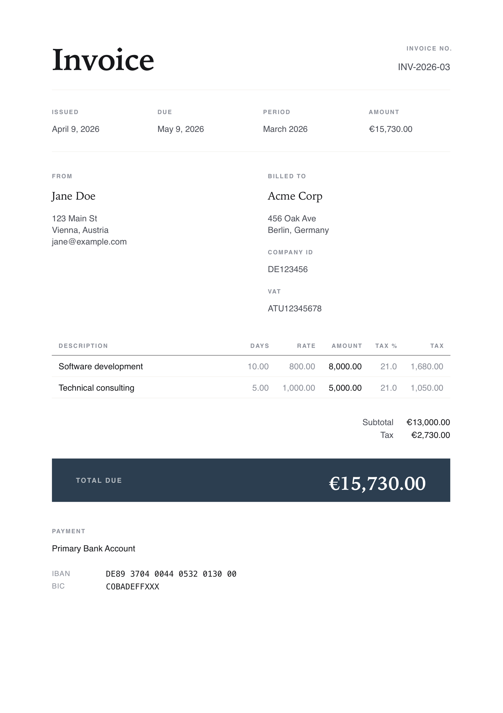

# invoice-generator

[](https://github.com/anton-kochev/invoice-generator/actions/workflows/ci.yml)
[](https://github.com/anton-kochev/invoice-generator/releases)
[](LICENSE)

A CLI tool that generates professional PDF invoices through an interactive prompt session. Built for freelance developers who send monthly invoices and need a fast, repeatable workflow with minimal manual input.



## Table of Contents

- [Features](#features)
- [Prerequisites](#prerequisites)
- [Installation](#installation)
- [Configuration](#configuration)
- [Usage](#usage)
- [Config File Format](#config-file-format)
- [PDF Output](#pdf-output)
- [License](#license)

## Features

- **First-run setup wizard** — interactive walkthrough creates the config file from scratch; resumes from where you left off if interrupted
- **YAML-based configuration** — sender, recipients, payment methods, line-item presets, and invoice defaults
- **Config validation** — clear reporting of missing or malformed sections with guidance on how to fix
- **Multiple recipients** — define several client profiles and select by key; set a default for quick invoicing
- **Multiple senders** — define several sender identities (e.g. business entities) and select by key; set a default for quick invoicing
- **Reusable presets** — define common billable items (description + default rate + optional currency and tax rate) and select them by number during invoicing
- **Daily or hourly billing** — each preset declares whether its rate is per day or per hour; prompts and console summaries adapt automatically, and a single invoice may mix daily and hourly line items. ⚠️ The PDF templates do **not** adapt yet — see [Billing units in the PDF](#billing-units-in-the-pdf)
- **Inline preset creation** — add new presets on the fly during invoice generation without editing the config file
- **Per-preset currency and tax** — each preset can carry its own currency and tax rate, overriding the global default
- **Smart defaults** — billing month defaults to last month, currency to EUR, payment terms to 30 days
- **Decoupled template system** — 3 templates (amalthea, metis, thebe) ship in the binary; additional templates are fetched on demand from a remote GitHub repo without needing a new binary release
- **Locale-aware formatting** — dates and numbers in the PDF follow locale rules (en-US, en-GB, de-DE, fr-FR, cs-CZ, uk-UA)
- **Non-interactive CLI mode** — `invoice-generator generate` for scripting and CI; supports single-item (`--preset` with `--quantity`/`--days`/`--hours`) or multi-item (`--items` JSON)
- **Preset, recipient, sender, and template management** — `invoice-generator preset list|delete`, `invoice-generator recipient list|add|delete`, `invoice-generator sender list|add|delete`, and `invoice-generator template refresh` subcommands
- **Professional PDF output** — clean A4 layout rendered via Typst with line-item table, payment details, and formatted totals
- **Overwrite protection** — interactive mode prompts before overwriting an existing PDF (`generate` overwrites without asking, by design, so it stays scriptable); standardized filenames (`Invoice_Name_MonYYYY.pdf`)

## Prerequisites

Installing via Homebrew needs no toolchain. To build from source you need:

- [Rust](https://www.rust-lang.org/tools/install) 1.85+ (edition 2024)

## Installation

### Homebrew (recommended)

```sh
brew install anton-kochev/tap/invoice-generator
```

### From source

```sh
git clone https://github.com/anton-kochev/invoice-generator.git
cd invoice-generator
cargo build --release
```

The binary will be at `target/release/invoice-generator`.

## Configuration

By default, the config file lives at `~/.config/invoice-generator/config.yaml` (XDG Base Directory specification). The directory is created on first run.

To override the location, use one of (in priority order):

- `--config <PATH>` — CLI flag (works on all subcommands)
- `INVOICE_GENERATOR_CONFIG=<PATH>` — environment variable

### Upgrading from v0.1.0

Earlier versions stored the config as `./invoice_config.yaml` in the current directory. To migrate:

```sh
mkdir -p ~/.config/invoice-generator
mv ./invoice_config.yaml ~/.config/invoice-generator/config.yaml
```

## Usage

```sh
# Interactive mode — setup wizard on first run, then invoice generation
invoice-generator

# Non-interactive: generate a single-item invoice
invoice-generator generate --month 3 --year 2026 --preset dev --days 10

# An hourly preset takes --hours
invoice-generator generate --month 3 --year 2026 --preset support --hours 8

# --quantity works with either, taking the preset's own unit
invoice-generator generate --month 3 --year 2026 --preset support --quantity 8

# Non-interactive: multiple line items via JSON (each entry takes its preset's unit)
invoice-generator generate --month 3 --year 2026 --items '[{"preset":"dev","quantity":10},{"preset":"support","quantity":8}]'

# Override template and locale for a single invoice
invoice-generator generate --month 3 --year 2026 --preset dev --days 10 --template amalthea --locale de-DE

# Target a specific client
invoice-generator generate --month 3 --year 2026 --preset dev --days 10 --client acme

# Target a specific sender
invoice-generator generate --month 3 --year 2026 --preset dev --days 10 --sender me-llc

# Manage presets
invoice-generator preset list
invoice-generator preset delete old-key

# Manage recipients
invoice-generator recipient list
invoice-generator recipient add
invoice-generator recipient delete old-key

# Manage senders
invoice-generator sender list
invoice-generator sender add
invoice-generator sender delete old-key

# Refresh the remote template manifest
invoice-generator template refresh
```

On first run, the setup wizard walks you through entering your details, client info, payment methods, and presets. On subsequent runs, you go straight to invoice generation.

### Quantity flags

A preset is billed either per day or per hour — never both — and the preset is always the authority on which. Pick the flag that says what you mean:

| Flag | Behaviour |
| --- | --- |
| `--quantity N` | Unit-agnostic. Bills `N` of whatever unit the preset uses. |
| `--days N` | Bills `N` days, and *asserts* the preset is a daily one. Errors if it is hourly. |
| `--hours N` | Bills `N` hours, and *asserts* the preset is an hourly one. Errors if it is daily. |

`--days` and `--hours` are deliberately not aliases of `--quantity`: `--hours 8` against a daily preset would otherwise silently bill 8 *days*. Instead you get

```
--hours cannot be used with preset "dev" (billed in days) — use --days or --quantity
```

In `--items` JSON, use the `quantity` key; the older `days` key is still accepted as an alias.

### Interactive Flow

```
INVOICE GENERATOR

Month [3]: 3
Year [2026]: 2026

Select a preset for this line item:

  [1] dev — Software development (EUR 800.00/day)
  [2] support — Support retainer (EUR 100.00/hour)
  [3] + Create new preset
Select preset number: 1

Line item #1: Software development
Days worked: 10
Rate per day [800]: 800
  => 10.00 days x 800.00/day = 8000.00

Add another line item? Yes

Select a preset for this line item:
  ...
Select preset number: 2

Line item #2: Support retainer
Hours worked: 8
Rate per hour [100]: 100
  => 8.00 hours x 100.00/hour = 800.00

Add another line item? No
```

Prompt wording follows the preset's unit throughout. When you create a preset — in the wizard or inline during invoicing — you pick its unit right after the description:

```
Short key (e.g. 'dev'): support
Description: Support retainer
Billing unit:
  [1] days
  [2] hours
Select unit number: 2
Default hourly rate: 100
```

Before generating the PDF, you see a summary for review:

```
+--------------------------------------+
|          INVOICE SUMMARY             |
+--------------------------------------+
| Invoice:  INV-2026-03                |
| Date:     2026-04-09                 |
| Due:      2026-05-09                 |
+--------------------------------------+
| Software development                 |
|   10.00 days x 800.00 = 8000.00 EUR  |
| Support retainer                     |
|   8.00 hours x 100.00 = 800.00 EUR   |
+--------------------------------------+
| TOTAL: 8800.00 EUR                   |
+--------------------------------------+

Generate PDF? Yes
PDF saved: /path/to/Invoice_Jane_Doe_Mar2026.pdf
```

## Config File Format

The tool stores all static data in a YAML config file (default: `~/.config/invoice-generator/config.yaml` — see [Configuration](#configuration) for overrides). You can edit it by hand or let the setup wizard generate it.

```yaml
senders:
  - key: "jane"
    name: "Jane Doe"
    address:
      - "123 Main Street"
      - "Springfield, IL 62704"
    email: "jane@example.com"
    # Optional free-form fields consumed by specific templates (see below).
    # These must be nested under `extras:` — a stray top-level key is ignored.
    extras:
      name_ua: "Джейн Доу"

default_sender: "jane"

recipients:
  - key: "acme"
    name: "Acme Corp"
    address:
      - "456 Oak Avenue"
      - "Shelbyville, IL 62565"
    company_id: "AC-12345"
    vat_number: "CZ12345678"
  - key: "globex"
    name: "Globex Inc"
    address:
      - "789 Elm Street"
      - "Capital City, IL 62705"

default_recipient: "acme"

payment:
  - label: "SEPA Transfer"
    iban: "DE89370400440532013000"
    bic_swift: "COBADEFFXXX"

presets:
  - key: "dev"
    description: "Software Development"
    default_rate: 100.0
    unit: days
  - key: "support"
    description: "Support Retainer"
    default_rate: 95.0
    unit: hours
  - key: "consulting"
    description: "Technical Consulting"
    default_rate: 150.0
    unit: days
    currency: "USD"
    tax_rate: 21.0

defaults:
  currency: "EUR"
  payment_terms_days: 30
  invoice_date_day: 9
  template: "amalthea"
  locale: "en-US"

branding:
  accent_color: "#2563eb"
  footer_text: "Thank you for your business!"
```

### Defaults

| Field | Default | Description |
|-------|---------|-------------|
| `currency` | `EUR` | Currency code used in invoice |
| `payment_terms_days` | `30` | Days until payment is due |
| `invoice_date_day` | `9` | Day of the month for the invoice date (following month) |
| `template` | `amalthea` | PDF template name (any installed template; see [Templates](#templates)) |
| `locale` | `en-US` | Locale for date/number formatting in PDF (en-US, en-GB, de-DE, fr-FR, cs-CZ, uk-UA) |

All sections except `defaults` and `branding` are required. The `defaults` section is optional and falls back to the values above. Field aliases are supported for convenience (`bic` for `bic_swift`, `vat` for `vat_number`).

Older configs with a single `recipient` field (instead of `recipients` list) — and likewise a single `sender` field (instead of `senders` list) — are still supported and automatically migrated on the next write.

Presets written before billing units existed have no `unit` key; they load as `days`, which is what they always meant. The key is written out explicitly on the next save. To change an existing preset's unit, edit `unit:` in the config file by hand — there is no `preset edit` command yet.

See [Billing units in the PDF](#billing-units-in-the-pdf) for a current limitation affecting hourly presets.

### Sender extras (template-specific fields)

A sender entry may carry arbitrary extra fields beyond the typed ones (`name`, `address`, `email`), nested under an `extras:` mapping. These are an unchecked escape hatch for template-only data — for example, the bilingual `io` template reads a Ukrainian `name_ua` and extended bank details.

```yaml
senders:
  - key: "jane"
    name: "Jane Doe"
    extras:
      name_ua: "Джейн Доу"
```

Each key under `extras` is flattened onto the sender when the template renders, so `name_ua` above becomes `sender.name_ua` in the Typst source. Templates that don't reference a given key simply ignore it.

Two things to watch:

- **The `extras:` nesting is required.** A key placed directly on the sender (`name_ua:` as a sibling of `name:`) is an unknown field. The config parser ignores it silently — no error, and the template never sees the value.
- **An extra that collides with a typed field** (e.g. `name`) shadows the typed value in the rendered output.

The setup wizard never prompts for extras; they're hand-edit only.

## PDF Output

The generated PDF is an A4 document — typically one page, though a long line-item list flows onto a second — with:

- **Header** — "Invoice" title with invoice number, and a meta strip carrying the billing period, invoice date, and due date
- **Parties** — sender and recipient side by side, including optional company ID and VAT number
- **Line items table** — description, quantity, rate, and amount per item, plus tax rate and tax amount when any item is taxed
- **Total** — bold, right-aligned in the configured currency
- **Payment details** — one block per payment method with IBAN and BIC/SWIFT
- **Footer** — the configured `branding.footer_text`

Exact layout varies by template; the above describes `amalthea`.

### Billing units in the PDF

**Only `adrastea` is unit-aware.** Every other template renders an hourly invoice with daily wording:

- `amalthea`, `metis`, `callisto`, `europa` label the quantity column **"Days"** whatever the unit
- `thebe` is worse — it prints the quantity inline as `8.00 d × 95.00`, so an hourly item reads as days in the body text rather than just in a heading
- `io` has no quantity column, so it is unaffected

**Amounts, rates, and totals are always correct** — the arithmetic never depended on the unit. Only the wording is wrong.

The data is already there: the generator emits `invoice.unit_label` (`"Days"`, `"Hours"`, or `"Qty"` for a mixed invoice) and a per-item `quantity` and `unit`, alongside the legacy `days` key. The remaining templates just don't read it yet.

`adrastea` does, and shows what that looks like:

- the quantity column header follows the unit — **"Days"**, **"Hours"**, or **"Qty"** when one invoice mixes both
- on a mixed invoice each row carries its own `d`/`h` suffix, since a single header can't name two units
- hourly quantities render as clock time: `2.75` hours prints as **2:45**

That last one is presentational only — you still enter and are billed decimal hours, so a quantity that doesn't land on a whole minute shows a rounded clock time next to an amount computed from the unrounded value (`2.33` → `2:20`, billed as 2.33). Quarter-hours are exact.

If the PDF wording matters to your clients, use `adrastea` for hourly work, or prefer daily presets.

### Templates

Templates are stored as `.typ` files (Typst source) in `~/.config/invoice-generator/templates/`. They control the visual style of the PDF and are decoupled from the CLI binary — adding or modifying a template doesn't require a new release.

**Three templates ship bundled with the binary** and are written to your local templates dir on first run:

| Template | Style |
|----------|-------|
| `amalthea` | Editorial & refined |
| `metis` | Bare-bones & printable |
| `thebe` | Compact & dense |

**Additional templates are available remotely** from the project's GitHub repo (`templates/` directory). They're not bundled in the binary; you fetch them on demand:

| Template | Style |
|----------|-------|
| `callisto` | Bold & structured |
| `europa` | Designed minimal |
| `io` | Bilingual UA/EN refined card |
| `adrastea` | Minimal & monospaced — the only unit-aware template (see [Billing units in the PDF](#billing-units-in-the-pdf)) |

**Installing a remote template:**

1. Run `invoice-generator template refresh` to fetch the latest manifest of available templates.
2. During invoice generation, when prompted to select a template, pick "Browse remote templates…" — pick a template, and it's downloaded to `~/.config/invoice-generator/templates/` and used for the current invoice.

After install, the template is local and works offline. The CLI never makes a network call except via `template refresh` and the explicit "Browse remote templates…" flow.

**Adding your own template:** drop a `.typ` file in `~/.config/invoice-generator/templates/`. It'll appear in the prompt on next run.

**Set the default** in config (`defaults.template`) or override per-invoice with `--template` in CLI mode. In interactive mode, you're prompted to change the template before generating.

### Locale Formatting

Dates and numbers in the PDF respect the configured locale. The console UI always remains in English.

| Locale | Date example | Number example |
|--------|-------------|----------------|
| `en-US` | March 9, 2026 | 4,442.40 |
| `en-GB` | 9 March 2026 | 4,442.40 |
| `de-DE` | 9. März 2026 | 4.442,40 |
| `fr-FR` | 9 mars 2026 | 4 442,40 |
| `cs-CZ` | 9. března 2026 | 4 442,40 |
| `uk-UA` | 9 березня 2026 | 4 442,40 |

Filenames follow the pattern `Invoice_{Name}_{MonthAbbrev}{Year}.pdf` (e.g., `Invoice_Jane_Doe_Mar2026.pdf`).

## License

MIT © Anton — see [LICENSE](LICENSE).
